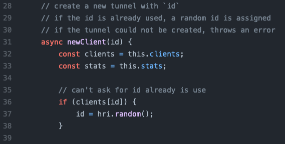
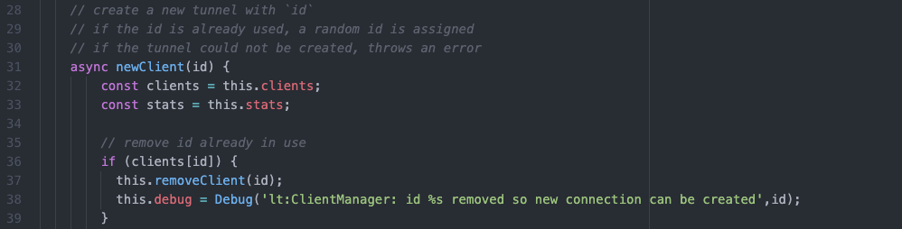

# GVE_DevNet_SWc_ISE_Remediation
A PoV developed to automate the remediation of endpoints via ISE, without opening network firewall ports.
An Alert is initially formed in StealthWatch Cloud and sent to SecureX.
SecureX is then configured with a custom workflow that will forward a request to ISE for remediation.

## Contacts
* Alexander Hoecht

## Solution Components
* StealthWatch Cloud, SecureX, ISE, PxGrid, Python3

# How To (for MacOS)
## Installation
Start by cloning the repository, and navigate to the project directory.
```
# Create and enter a Virtual Environment
python3 -m venv VirtualEnv
source VirtualEnv/bin/activate (On MacOS)
```
```
# Install dependancies
pip install -r requirements.txt
```
```
# Define environmental variables
export FLASK_APP=src
export FLASK_ENV=development
```

## Configuration
Create PxGrid Certificates and import into src/certs directory.<br>
    - NOTE: find helpful documentation here:
        - https://github.com/cisco-pxgrid/pxgrid-rest-ws/wiki/ANC-configuration

Once the Certifications are imported, define the base configuration of PxGrid within src/portal.py.
(NOTE: This can be altered later when using the application)
```
PXGRID_ANC_SERVICE_NAME = 'com.cisco.ise.config.anc'
DEFAULT_PXGRID_CONFIG = {
	'hostname': 'ISE_DOMAIN_NAME',
    'nodename': 'PXGRID_CLIENT_NAME',
    'password (optional)': '',
    'description (optional)': '',
    'clientcert': 'src/certs/PXGRID_CLIENT.cer',
    'clientkey': 'src/certs/PXGRID_CLIENT.key',
    'clientkeypassword': 'PXGRID_CLIENT_KEY_PASSWORD',
    'servercert': 'src/certs/ISE_DOMAIN_NAME_ISE_DOMAIN_NAME.cer',
    'secret': ''
}
```

## Start Application
```
# Validate application routes are created
flask routes
```
```
# Create application database
flask init-db
```
```
# Start application
flask run
```

## (OPTIONAL) Tunnel Setup
### OPTION 1) Local Tunnel
    1) Clone the Local Tunnel Server [here](https://github.com/localtunnel/server)
    2) Within the Repo, Edit /lib/ClientManager.js
FROM<br>

<br>TO<br>

    
    3) Start Local Tunnel Server
    ```
    bin/server --port {{any non-root TCP port}}
    ```
    4) Create Tunnel to Application Port
    ```
    lt --port 5000 --subdomain {{TunnelName}}
    ```

### OPTION 2) PacketRiot
Initial [PacketRiot](https://packetriot.com/) setup

    1) Create and Verify a Free Account
    2) Install PacketRiot for your OS here -> https://packetriot.com/downloads
    3) Extract downloaded files
    4) Navigate to Extracted file location
    5) Configure PacketRiot:
        $ pktriot configure
    6) Verify a working Tunnel has been created:
        $ pktriot start

Map PacketRiot Tunnel to application
(Assuming PoV is running on http://127.0.0.1:5000)

    1) Get Tunnel info
		$ pktriot info
	2) Add HTTPS traffic rule
		$ pktriot tunnel http add —domain <PacketRiot Client Hostname> —destination 127.0.0.1 —http 5000
	3) Start Tunnel
		$ pktriot start
If all steps are completed correctly, visiting the <PacketRiot Client Hostname> should display the PoV.

### Option 3) NGROK [WARNING! Ngrok is currently blocked on Cisco Networks]
    1) Install [NGROK](https://ngrok.com/download)
    2) Start NGROK on port of the application -> /PATH/TO/ngrok http 5000

## SercureX SetUp
On SecureX, Modify workflow "Target URL"
```
Protocol = HTTPS
Host/IPaddress = {{ Tunnel Domain }}
Path = /secureXWorkflow
```
NOTE: SecureX Workflows will be authenticated by Basic HTTP Auth (Username & Password)
Ensure you have a registered user on the PoV, before sending SecureX Workflows!

# Screenshots


### LICENSE

Provided under Cisco Sample Code License, for details see [LICENSE](INTERNALDOCS/LICENSE.md)

### CODE_OF_CONDUCT

Our code of conduct is available [here](INTERNALDOCS/CODE_OF_CONDUCT.md)

### CONTRIBUTING

See our contributing guidelines [here](INTERNALDOCS/CONTRIBUTING.md)

#### DISCLAIMER:
<b>Please note:</b> This script is meant for demo purposes only. All tools/ scripts in this repo are released for use "AS IS" without any warranties of any kind, including, but not limited to their installation, use, or performance. Any use of these scripts and tools is at your own risk. There is no guarantee that they have been through thorough testing in a comparable environment and we are not responsible for any damage or data loss incurred with their use.
You are responsible for reviewing and testing any scripts you run thoroughly before use in any non-testing environment.
